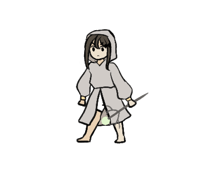

<body style="background-color:#FFE0C7;">

<body>

  <a href="#about">About</a>
  <a href="#services">Art</a>
  <a href="#clients">Projects</a>
  <a href="#contact">Contact</a>

  

    
    
    

<h1>ABOUT</h1>

<b>kaithope</b>, more commonly known by the username <b>grinnykat</b>, is a self-taught artist aspiring to one day make games. Also is trying to just get by and graduate high school.

Currently has two ongoing webcomics on <b>Webtoon Discover</b>, <b>Starry Edelweiss</b> and <b>Mercy of Tomorrow</b>. (both are updated irregularly at the moment)

 
 

  

    
    
    
  

  

    <h3>fun facts</h3>
<ul>
  <li>proud to be INC!!</li>
  <li>I think baby chicks are adorable for one reason</li>
  <li>game series I'm into + my favorite:</li>
  <ul>
    <li>Pokemon // X</li>
    <li>Fire Emblem // Awakening</li>
    <li>Animal Crossing // New leaf</li>
    <li>Hello Charlotte // Ep. 1</li>
  </ul>
  <li>filipina, but can barely understand Tagalog and can't speak it at all</li>
  <li>went through something called the Calem Phase which I still don't regret</li>
  <li>will fight anyone who thinks Vocaloid songs are bad songs</li>
</ul>
  

